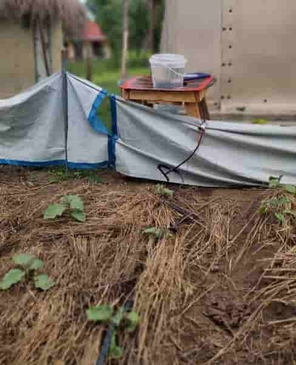

   

 ## Introduction
 
Watering plants manually can be time-consuming and inefficient especially in places with long dry spell for instance in Rhino camp refugee settlement in Uganda. This DIY project guides Students  to build a low-cost automatic irrigation system using locally available materials from discarded waste and simple electronics.
The system uses a soil moisture sensor to detect when plants need water and a 12V DC pump to deliver water automatically. The project is mounted on a wooden base, with containers acting as the mini farm and water tank.
 
<p align="center" width="100%"><br><em>Complete DIY functional Automatic Irrigation System developed by CC4D</em></p>


### Learning Objectives

By the end of this activity, learners will:

    1. Assemble basic electronic components into a functional project.
    2. Apply principles of sustainability and DIY innovation by reusing containers.
    3. Demonstrate safe handling of simple electronic tools and materials.

### Materials Needed

    • 1 wooden board – base for the project.
    • 2 × 9V batteries – one for the Arduino, one for the pump.
    • 2 switches – to control Arduino power and pump power.
    • Connecting wires – for electrical connections.
    • 1 plastic tray (cut from a jerrycan) – mini farm bed.
    • 1 plastic container – water tank.
    • 1 × 12V DC water pump – to pump water.
    • 1 × Soil Moisture Sensor – to detect soil dryness.
    • 1 × 12V Relay Module – to control pump switching.
    • 1 Arduino Uno (or similar) – brain of the system.
    • 1 tube for water distribution to the farm
Optional: screws, glue, tape, soldering iron  for better mounting.
    
   

### Circuit Connections

    1. Soil Moisture Sensor → Arduino analog pin (e.g., A0), VCC, GND.
    2. Relay Module → Arduino digital pin (e.g., D7), VCC, GND.
    3. Pump → Connected to relay output, powered by 9V battery.
    4. Arduino → Powered by separate 9V battery with its own switch.
    5. Switches → Installed between each battery and device (Arduino + Pump).

  
  
### Assembly Steps.

    1. Prepare the base: Fix the wooden board as your working platform.
    2. Mini farm tray: Cut a jerrycan into a shallow tray and place soil + plants.
    3. Water tank: Cut a container, fill with water, and place pump inside.

    

    4. Mount electronics: Fix Arduino, relay, and switches onto the board.
    5. Wiring: Connect components as per circuit plan. Ensure switches work.

    
    
    6. Upload Arduino code: Use Arduino IDE to upload the irrigation code (sample below).
    7. Test system: Power on, water should flow automatically when soil is dry.
    
  ### Sample Arduino Code

``` // DIY Automatic Irrigation System


const int dryValue = 800;
const int wetValue = 334;
 void setup() {
  // put your setup code here, to run once:
Serial.begin(9600);
pinMode(10,OUTPUT);
}
void loop() {
  // put your main code here, to run repeatedly:
analogRead(A2);
Serial.println(analogRead(A2));
if(analogRead(A2)>=800){
  digitalWrite(2,HIGH);
  }
  if(analogRead(A2)<=334){
    digitalWrite(2,LOW);
    }
}
```


### Reflection 

    • What role does the relay play in this project?

    1. Isolation:
          Arduino works at 5V and cannot directly power the 12V pump.
          The relay keeps the two circuits separate but allows control.
    2. Switching:
          The relay turns the pump ON or OFF depending on the Arduino’s signal.
          When the soil is dry, Arduino sends a signal → relay closes the circuit → pump runs.
          When the soil is wet, Arduino stops the signal → relay opens the circuit → pump stops.
    3. Safety:
          Prevents the high current from the pump from damaging the Arduino.
        The relay is the “bridge” that lets the tiny Arduino safely control the powerful water pump

    • Why is it important to separate the Arduino and pump power supplies?

    1. Prevent voltage drops:
          Pumps draw a lot of current when running.
          If they share power with the Arduino, the sudden current draw can cause the Arduino to reset or malfunction.
    2. Noise protection:
          Motors and pumps generate electrical noise (spikes and fluctuations).
          This noise can interfere with the Arduino’s sensitive electronics and cause unreliable sensor readings.
    3. Safety for components:
          Arduino is designed for low-power loads.
          By giving the pump its own battery, you avoid overloading the Arduino’s circuit.
    4. Longer runtime:
          Two separate batteries balance the load.
          The Arduino (low power) can keep monitoring the soil even if the pump’s battery drains faster.

             Using separate power supplies keeps the Arduino stable, prevents interference, and     protects it from the heavy demands of the pump.

    • How does the soil moisture sensor decide when to water?

    1. Sensing principle:
          The sensor has two metal probes that go into the soil.
          When soil is wet, water conducts electricity better → low resistance → lower sensor reading.
          When soil is dry, there’s little conductivity → high resistance → higher sensor reading.
    2. Arduino reads the signal:
          The sensor sends an analog value (e.g., between 0 and 1023) to the Arduino.
          This value tells how wet or dry the soil is.
    3. Comparison with threshold:
          In the code, you set a threshold value (e.g., 800).
          If sensor value > threshold → soil is dry → Arduino turns the relay ON → pump starts watering.
          If sensor value ≤ threshold → soil is wet → Arduino turns the relay OFF → pump stops.
 Example:
      Sensor reading = 334 → Soil is wet enough → Pump stays OFF.
      Sensor reading = 800 → Soil is too dry → Pump turns ON to water the plants.
 In short:
The soil moisture sensor acts like a judge — it measures how wet the soil is, compares it with the set threshold, and then tells Arduino whether to water or not.

    • What improvements would you make to this system?
Multiple sensors & zoning
      Why: Soil moisture is variable; one sensor may not represent whole bed.
      How: Add 4 sensors and average readings or control zones individually with multiple relays/pumps/valves.
Weatherproofing and enclosures
      Why: Protect electronics from rain and dust.
      How: Use IP-rated boxes, silicone seals, and strain reliefs for cables.

   ### Final Product 

  

