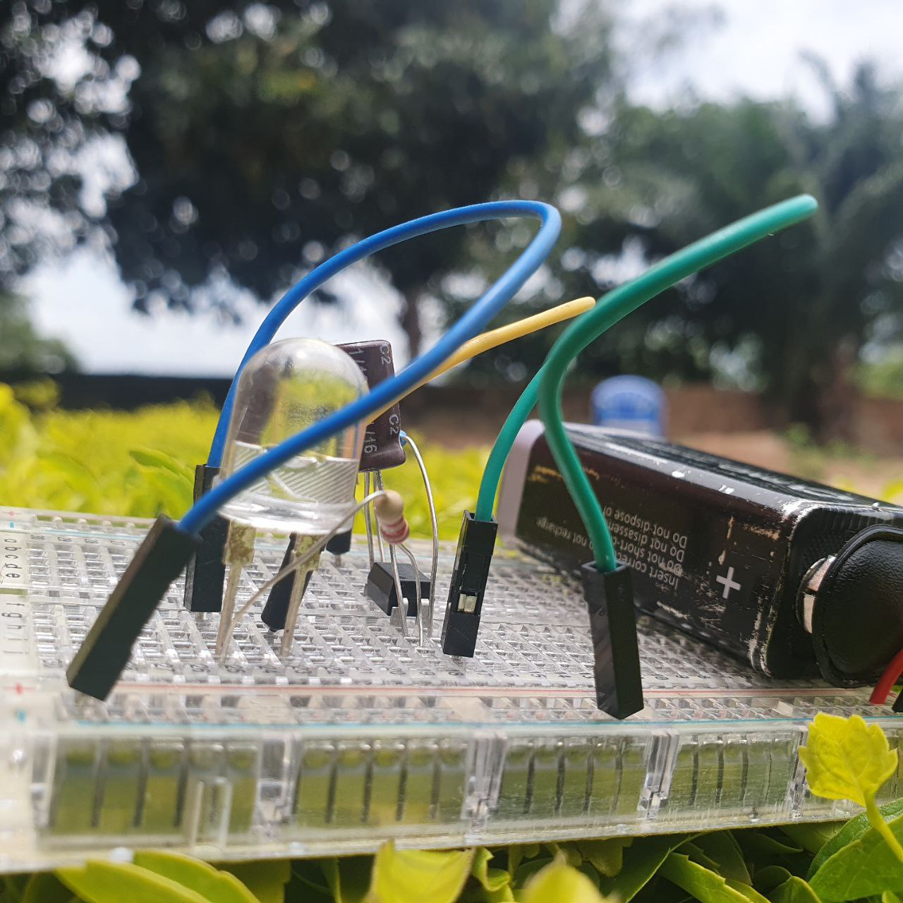

### Operation:
When the circuit is powered, the capacitor charges through the 1k ohm resistor.As the capacitor charges, the voltage across it increases.
Once the voltage across the capacitor reaches a certain threshold, the optocoupler triggers.
When the optocoupler triggers, it turns on the LED momentarily.After triggering, the capacitor discharges through the LED and the optocoupler.
The cycle then repeats, causing the LED to blink at a regular interval.

### Components
 

### Circuit Diagram:
 

### Instructions:

1. Connect the positive terminal of the 9V battery to the  postive terminal of the power rail.
2. Connect the negative  terminal of the 9V battery to negative terminal of the power rail.
3. Connect the postive terminal of the LED to the positive power rail. 
4. From the same spot connect a 10k resistor and connect the other pin to the Anode of the optocoupler. 
5. Connect the cathode of the optocoupler to the negative rail of the power supply 
6. From the anode of the optocoupler, connect a positive terminal of a capacitor and Connect its(capacitor) negative terminal to the Emitter of the optocoupler. 
7. Connect a 1k resistor to the cathode of the optocoupler and connect the  other end to the Emitter  of the optocoupler 
8. Connect the negative terminal (Anode) of the LED to the collector of the optocoupler.
9. test the circuit

### Complete project:

 <em>Complete circuit</em>

Ensure proper polarity and connections while building the circuit. Adjust the resistor values and capacitor size as needed to change the blinking frequency.

 Optocoupler: https://media.digikey.com/pdf/data%20sheets/fairchild%20pdfs/fod816.pdf
