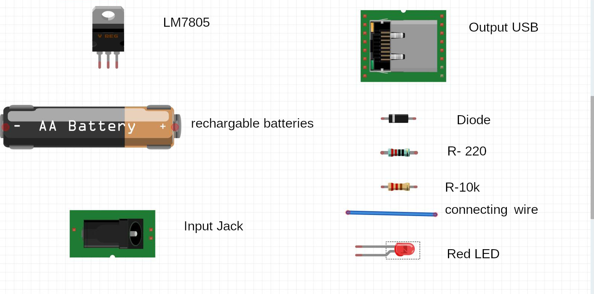
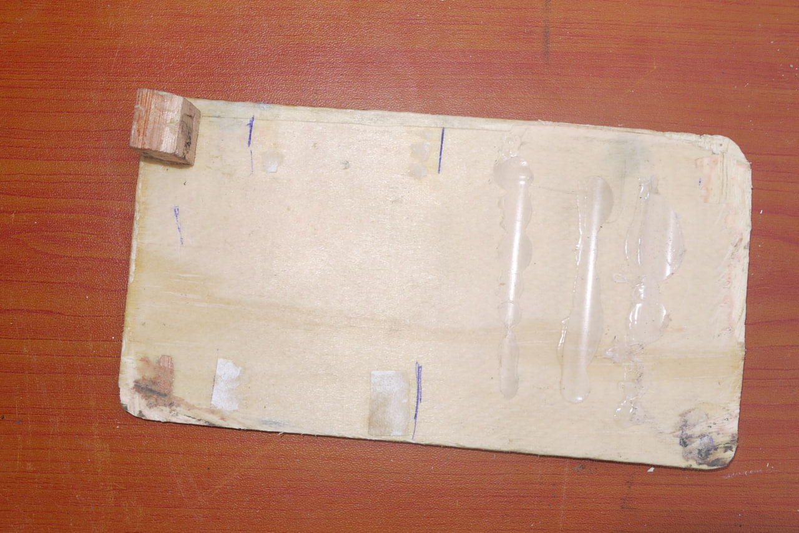
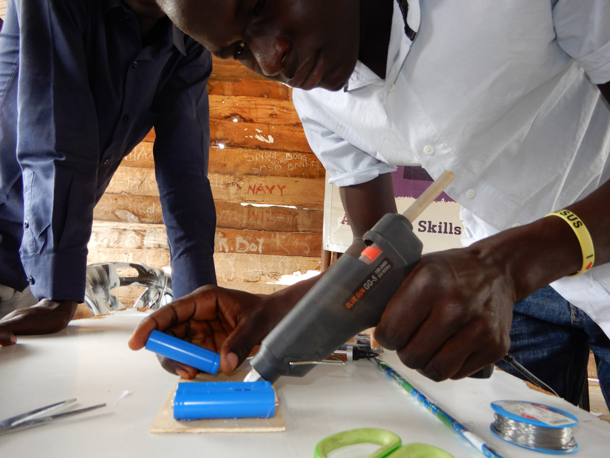
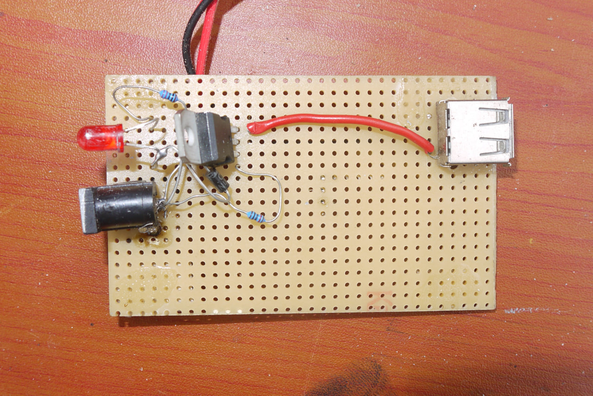

# DIY Power Bank

At the heart of this power bank circuit, are small 3.7V lithium- ion cells that are salvaged out of old broken lamps about 2600 mAh (milli ampere-hour) each.

## Materials

- LM7805
- 3x rechargeable AA batteries 
- Input jack
- Output USB
- Diode
- R-220
- R-10k
- Connecting wire
- Red LED  
  

 <em>Materials used</em>

Power banks can be used to charge cell phones, tablets, speakers, laptops, etc..

## Schematic

 <em>Schematics of the DIY power Bank</em>

## Assembly procedure 

- Look for a discarded electronic board.
- Remove required electronic materials.
- Level all electronic components.

 <em>Removing electronic components from a discarded electroinc board</em>

- Cut two rectangular boards of plywood measuring 4cm x 10cm. One will be used as base plate, the other will be used as a cover.

 <em>Plywood board</em>

- Cut side covers from plastics, or plywood to cover the edges of your power bank.

 <em>Plywood side cover elements</em>

- Place all ports (in / out) onto a circuit board and solder them in securely.
- Solder the red LED into the circuit board.
- Glue the three rechargeable batteries onto the plywood board.

 <em>Gluing the rechargeable batteries on the plywood board</em>

## Soldering the electronic components

Solder the voltage regulator into the circuit board:
- Connect the positive side of the batteries to the left terminal of the voltage regulator.
- Connect the negative side of the batteries to the middle terminal of the voltage regulator.
- Solder the negative output of the voltage regulator to the USB port.
- Solder the positive output of the voltage regulator to the USB port.

 <em>Soldered circuit</em>

- Coming from the charging port (jack), solder a 10k Ohm resistor to the left terminal of the voltage regulator as positive. 
- Connect the negative outpot of the charging port (jack) to the middle terminal of the voltage regulator.
- Connect the negative pole of the LED to the negative pole of the voltage regulator
- Connect the positive pole of the LED with the 220 Ohm resistor and with the positive pole of the charging port (jack).

## Final Steps
- Attach the circuit board onto the base plate.

 <em>Circuit board attached next to the batteries</em>
  

- Glue the side covers onto the plywood cover.

 <em>Side covers glued onto the plywood cover</em>

- Assemble your base plate with the circuit and the cover with the side elements together. 
- Plug the phone cable into the USB and test your **DIY Power Bank**.

 <em>Testing the DIY Power Bank</em>

