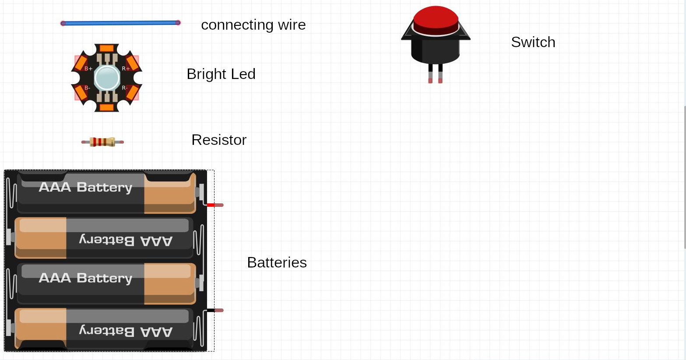
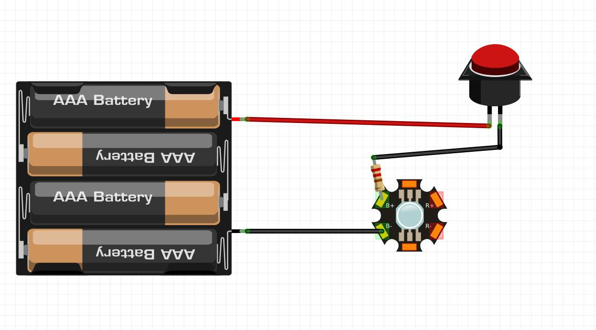
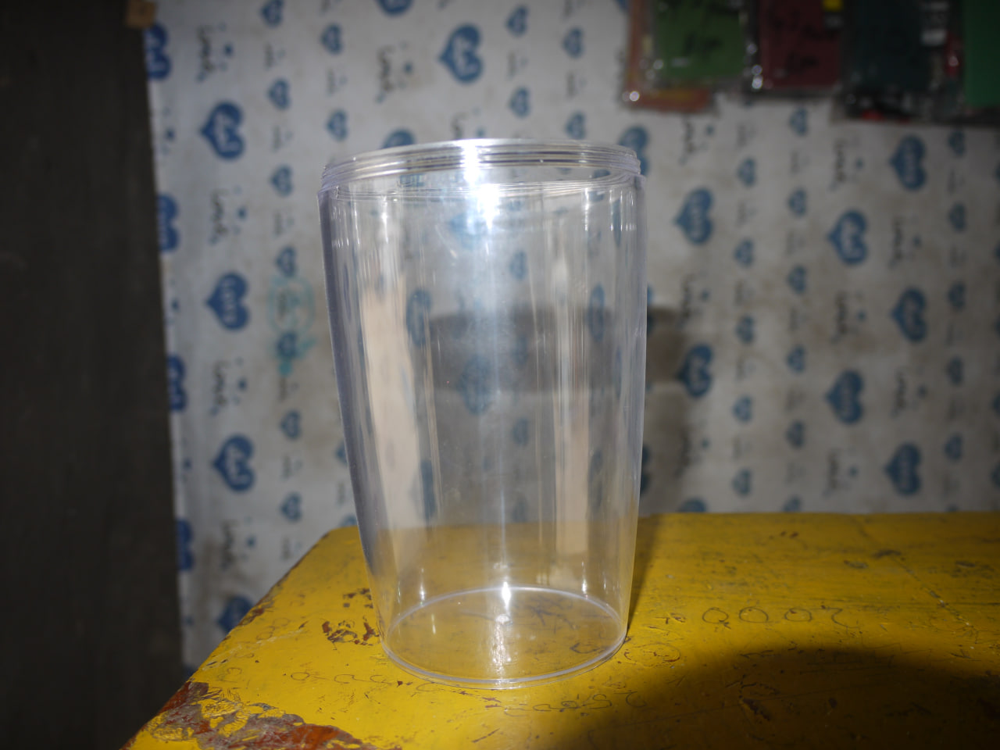
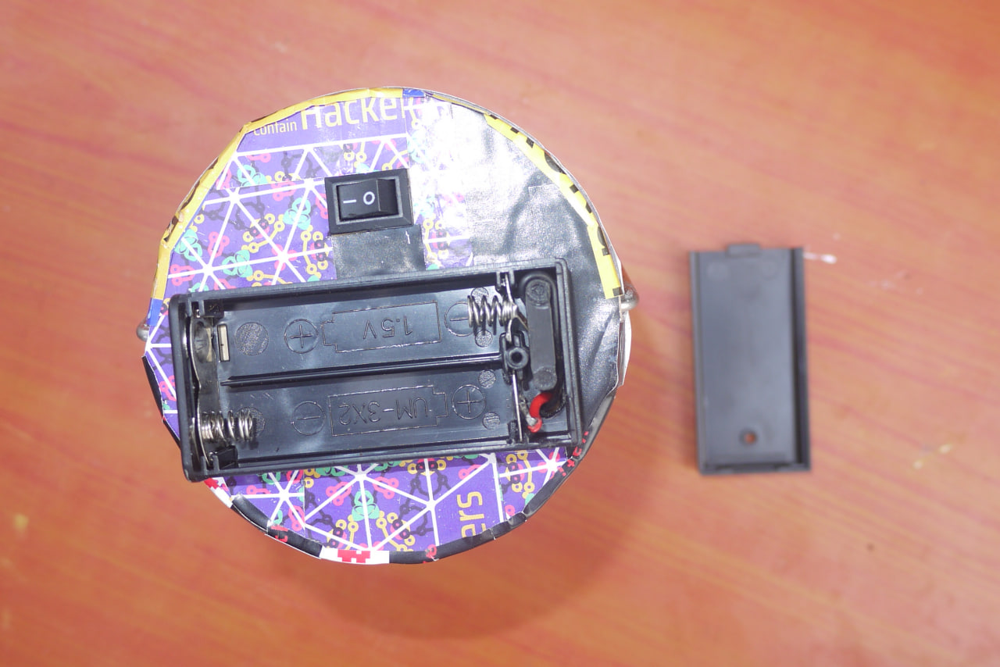
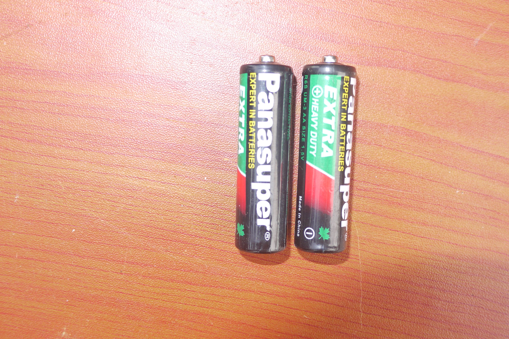
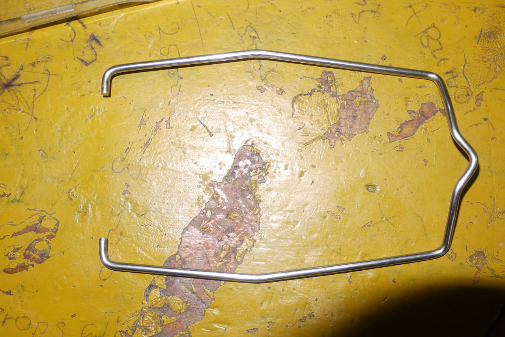
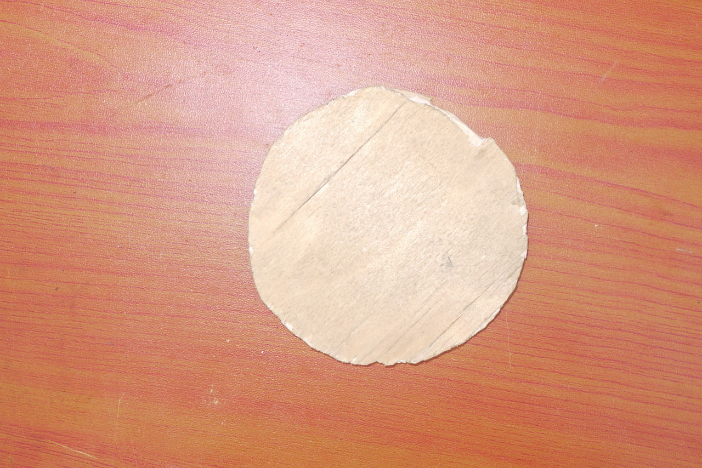
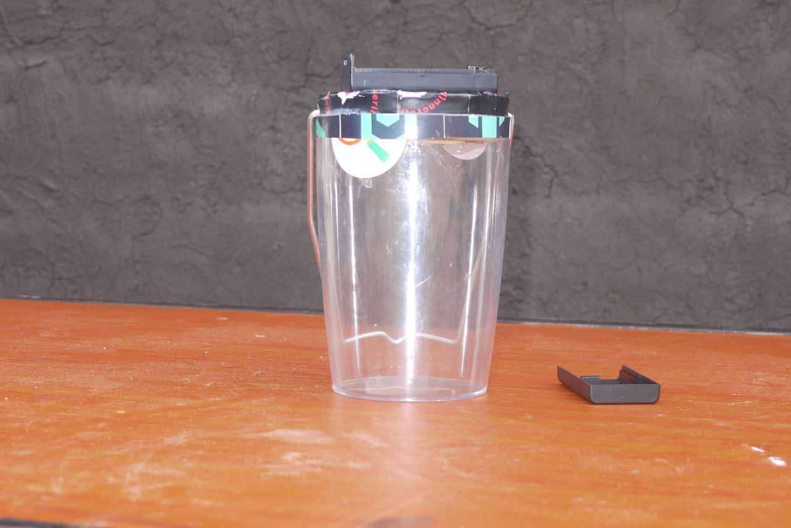

# Eco-Friendly Lamp
Embark on a creative journey as you learn to craft an eco-friendly lamp from a handful of discarded electronic components. Illuminate your space with a sustainable touch, blending functionality with aesthetic appeal. Join us in discovering the art of repurposing for both light and style!
## Materials

* LED
* connecting wires
* circuit board
* batteries
* batteries Holder
* used container (transparent)
* switch
* resistors 

 <em>Electronic components</em>

The most sustainable lamp materials are recycled and / or recyclable—such as scrap cardboard, glass waste, plastic bottles, and salvaged wood. When new natural materials are used (such as bamboo, wood, and shells) they should be responsibly sourced.

## Schematic

 <em>Schematic</em>

## Assembly procedure
### Gather materials:
Gather all the materials you will need for making the lamp, including batteries, a switch, a transparent container, cardboard for covering the container at the top, a battery case, wires, a bright LED, and a lamp holder.

### Preparing transparent container: 
You can use an old glass jar or a plastic container with a lid. Make sure it is clean and free from any debris.

 <em>Transparent container</em>

Punch a small hole in the container lid to accommodate the wires from the LED and the switch. This hole should be big enough to pass the wires through without any difficulty.

### Electronic components: 
**Take the LED and attach it to the wires.**  
Connect the positive side of the LED to the red wire and the negative side to the black wire. You can use electrical tape or soldering to secure the connections. Ensure proper insulation to avoid any short circuits.

**Connect the wires from the LED to the battery case.**  
 The red wire should be connected to the positive terminal, and the black wire to the negative terminal. Again, make sure the connections are secure and properly insulated.

 <em>Battery case</em>

**Attach the switch to the wires.**  
Connect the red wire to one terminal of the switch, and the black wire to the other terminal. Secure the connections, ensuring they are properly insulated.

**Place the batteries in the battery case.**  
Make sure the positive and negative terminals of the batteries match the corresponding terminals in the case. Close the case tightly to secure the batteries.

 <em>Batteries</em>

**Insert the wire with the LED and switch through the hole in the container lid.**  
Ensure the LED is facing downwards and goes inside the transparent container.

### Finalization: 
**Attach the lamp holder.**  
Attach the holder on top of the container lid. Ensure it fits securely and does not obstruct the LED.

 <em>Holder</em>

**Cut a piece of cardboard.**  
Use the cardboard to cover the top of the transparent container where the lamp holder is attached. This will act as a diffuser for the LED light and provide a softer glow.

 <em>Cardboard</em>

Place the cardboard cover on top of the container. Make sure it fits tight.

 <em>Eco-Friendly Lamp</em>

