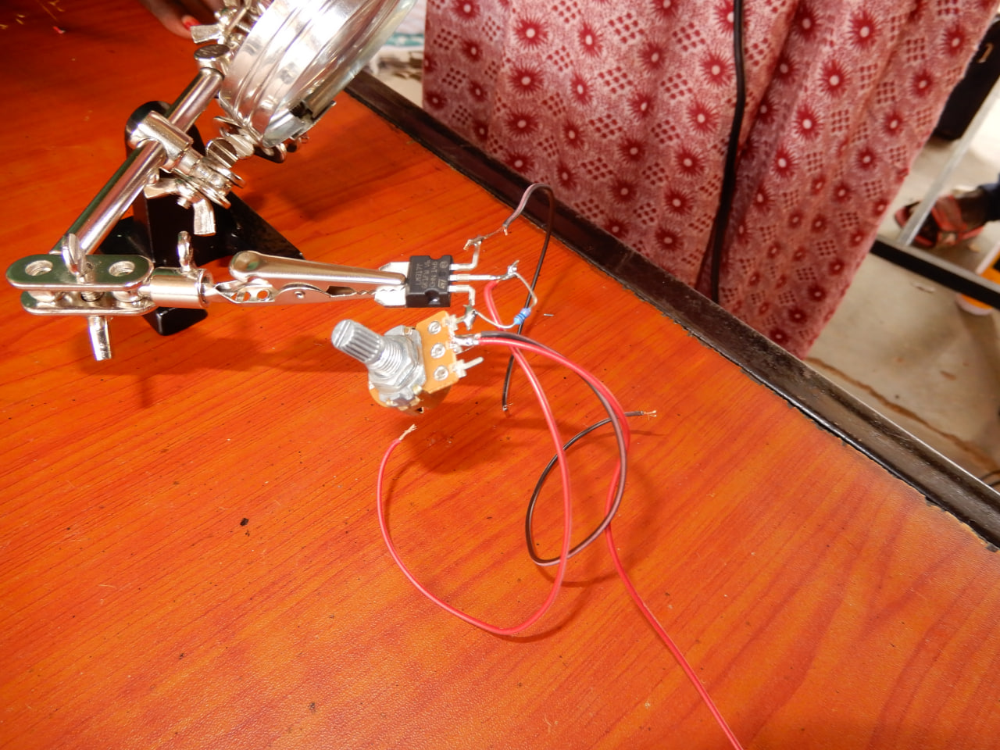

# Adjustable DC Voltage Regulator
An adjustable voltage regulator generates a DC output voltage that can be finely tuned within a specific voltage range. This type of regulator is commonly referred to as a variable voltage regulator. The DC output voltage from an adjustable voltage regulator can be either positive or negative.
 
## Materials
* Board
* 10k potentiometer
* Wires 
* Solder set
* Circuit board
* Connecting wires
* LM317T transistor
* Breadboard

## Schematics

 <em>DC-Voltage-Regulator-Schematics</em>

## Assembly procedure
- Solder a wire to the right terminal of the LM317 as the positive input.
- Solder the positive output wire to the middle terminal of the LM317.
- Connect the resistor from the middle terminal of the LM317 to the left terminal of the LM317 by soldering.

- Connect the right terminal of the potentiometer to the left terminal of the LM317.
- Attach a negative input to the middle terminal of the potentiometer.
- Connect a negative output to the middle terminal of the potentiometer.

 <em>Fully Assembled Adjustable Voltage Regulator</em>

## Product test  

 <em>Testing the Adjustable Voltage Regulator</em>

