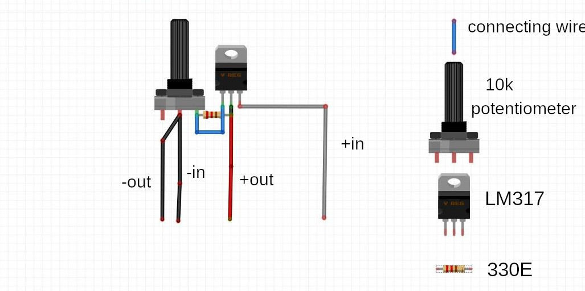

# Adjustable DC voltage regulator

An adjustable voltage regulator produces a DC output voltage, which can be adjusted to any other value of certain voltage range. Hence, adjustable voltage regulator is also called as a variable voltage regulator. The DC output voltage value of an adjustable voltage regulator can be either positive or negative.
 
 _Requirements:_
 
* Board
* potentiometer
* wires 
* solder set
* circuit board
* connecting wires
* LM317T Transistor
* bread board

## Steps Involved in the making 
-  Solder a wire as a positive input on right terminal of the LM317
    
-  Solder a positive output wire on the middle terminal of the LM317
-  From the middle terminal of the LM317, solder the resistor to the left terminal of LM317

- Join the right terminal of the potentiometer to the left terminal of the LM317 
- Connect a negative input in the middle terminal of the potentiometer 
-  Connect a negative output to the middle terminal of the potentiometer. 
- Test the product

  

