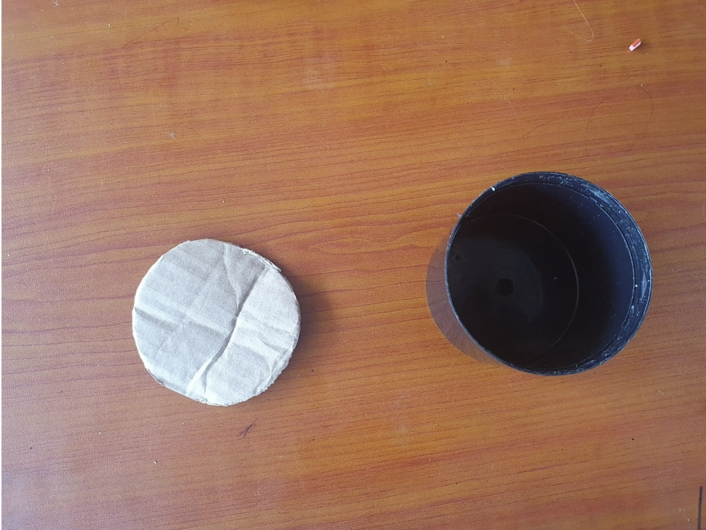

 # LED Disco Light
 This module guides you through the process of creating a vibrant and captivating USB-powered LED Disco Light using recycled electronic materials. Explore the art of crafting a colorful, blinking masterpiece from discarded components.

 ## Materials
- Red LED
- Green LED
- Plastic container (transparent or translucent)
- USB cable from e-waste
- Soldering iron and solder
- Electrical tape
- Wire stripper / cutter
- Small drill or a hot nail
 

 <em>Materials used</em>

## Schematic

 <em>Schematic for the LED Disco Light</em>

## Assembly procedure

### Preparing the LEDs  
Begin by identifying the positive (anode) and negative (cathode) terminals of each LED. Typically, the longer leg of the LED is the positive terminal (anode), while the shorter leg is the negative terminal (cathode). Make sure to note this distinction for both the red and green LEDs

### Creating the LED circuit 
Cut two short lengths of wire from the USB cable, making sure each wire is long enough to connect the LEDs to the circuit. Strip a small portion of insulation from each end of the wires to expose the copper strands. Then, solder one wire to the positive terminal of the red LED and the other wire to the positive terminal of the green LED. Ensure the soldered connections are secure, and cover the exposed connections with electrical tape for insulation.

### Preparing and assembling the container
Take the plastic container and determine the desired locations for the LEDs. Drill or heat a hole using a hot nail on the container's surface, ensuring it is large enough to snugly fit the LEDs. Exercise caution to avoid damaging the container during drilling or heating. Insert the red and green LEDs into the created holes, positioning their positive terminals facing outward. Secure them in place with a small amount of hot glue or adhesive if necessary.

 <em>Soldering the Anode and Cathode Terminals</em>

### Wiring the circuit
Cut the USB cable, separating the two wires inside (usually a red wire and a black or green wire). Strip a small portion of insulation from the cut ends of the wires. Connect the positive wire from the USB cable to the negative terminal (cathode) of the red LED using solder. Similarly, connect the negative wire from the USB cable to the negative terminal (cathode) of the green LED. Ensure the solder connections are secure and insulate them with electrical tape.

### Preparing the box
Cut a circular piece of cardboard from plywood or a box, and thread the USB wire through the plastic base.

 <em>Black plastic base and piece of cardboard</em>

### Powering the LED Disco Light
Connect the USB cable to a power source, such as a computer, laptop, or USB wall charger. The LEDs should illuminate, producing a vibrant disco effect inside the plastic container.

 <em>Fully Assembled LED Disco Light</em>

> **Warning**: Be cautious when working with electronics and soldering irons. Ensure your workspace is well-ventilated and take proper safety precautions.
